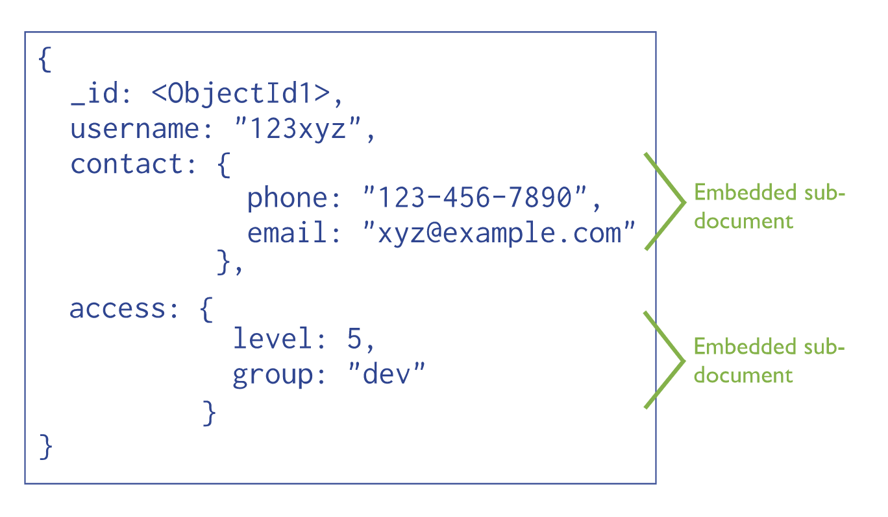
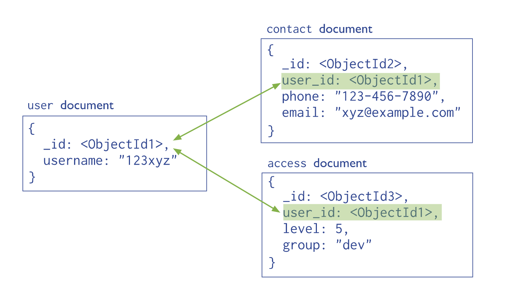

# Data Modeling
*`Clone the repository to get the Artists Album example`*

[ Reference: [MongoDB docs](https://docs.mongodb.com/manual/core/data-modeling-introduction/) ]
- Data in MongoDB has a `flexible schema`
  
  Unlike SQL databases, where you must determine and declare a table’s schema before inserting data, MongoDB’s collections, by default, does not require its documents to have the same schema. That is:

  - The documents in a single collection do not need to have the same set of fields and the data type for a field can differ across documents within a collection.

  - To change the structure of the documents in a collection, such as add new fields, remove existing fields, or change the field values to a new type, update the documents to the new structure.
- Collections do not enforce document structure by default.
- This flexibility gives you data-modeling choices to match your application and its performance requirements.
- The key decision in designing data models for MongoDB applications revolves around the structure of documents and how the application represents relationships between data. MongoDB allows related data to be embedded within a single document.

# Embedded data or references

## Embedded Data in MongoDB
Embedded documents capture relationships between data by storing `related data in a single document structure`. MongoDB documents make it possible to embed document structures in a field or array within a document. These denormalized data models allow applications to retrieve and manipulate related data in a single database operation.
In general, use embedded data models when:

- you have “contains” relationships between entities. See Model One-to-One Relationships with Embedded Documents.
- you have one-to-many relationships between entities. In these relationships the “many” or child documents always appear with or are viewed in the context of the “one” or parent documents.

[Click here to learn about strengths and weaknesses of embedding documents](https://docs.mongodb.com/manual/core/data-model-design/#data-modeling-embedding)

## Referenced data in MongoDB
References store the relationships between data by including links or references from one document to another. Applications can resolve these references to access the related data. Broadly, these are normalized data models.
In general, use normalized data models:
- when embedding would result in duplication of data but would not provide sufficient read performance advantages to outweigh the implications of the duplication.
- to represent more complex many-to-many relationships.
to model large hierarchical data sets.

[Click here to learn more about using references](https://docs.mongodb.com/manual/core/data-model-design/#data-modeling-referencing)

---
## Resources:
- Embedded documents: https://mongoosejs.com/docs/2.7.x/docs/embedded-documents.html

- Embed vs reference, modeling data in document database
  - [This stackoverflow post is spot on](https://stackoverflow.com/questions/5373198/mongodb-relationships-embed-or-reference)
  - https://www.youtube.com/watch?v=IUxT7ZRHlZ4&t=1s

- Defining schemas with relationships:
  - defining the schemas
   https://mongoosejs.com/docs/populate.html#populate
  - saving references
   https://mongoosejs.com/docs/populate.html#saving-refs
  - https://mongoosejs.com/docs/2.7.x/docs/populate.html
- Why GAP uses mongoDB
https://www.mongodb.com/blog/post/enabling-extreme-agility-gap-mongodb?c=7310eb88f8